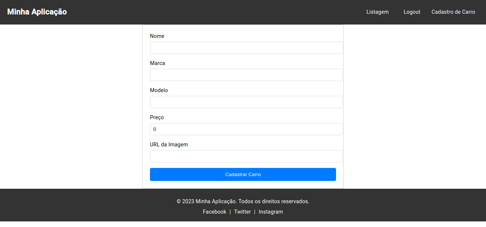

## Clonando o Repositório

Para começar, clone o repositório principal e seus submódulos com o seguinte comando:

`git clone --recurse-submodules git@github.com:GustavoGarciaPereira/teste_Verzel.git` 

Após clonar, você deve ver a seguinte estrutura de diretórios ao executar `tree -L 1`:

`.
├── back
├── docker-compose.yml
├── front
└── readme.md

2 directories, 2 files` 

## Executando o Projeto

Existem duas maneiras de executar o projeto:

### Usando Docker

Para uma execução rápida, preparei um Docker Compose que inicia ambos os projetos (front-end e back-end) simultaneamente. Na raiz do projeto, execute:

`sudo docker-compose build && docker-compose up && docker-compose down` 

Após a execução, acesse:

-   Front-end: [http://localhost:4200/welcome](http://localhost:4200/welcome)
-   Back-end: [http://localhost:8000/docs](http://localhost:8000/docs)

### Execução Manual

Alternativamente, você pode executar os projetos manualmente.

#### Back-end

Entre na pasta `back` e execute:

`sudo docker-compose build && docker-compose up && docker-compose down` 

#### Front-end

Em seguida, entre na pasta `front` e execute:

`npm install
ng serve --open` 

## Deploy da Aplicação

A aplicação também está disponível online:

-   Back-end: [https://asdf-h6q0.onrender.com/docs](https://asdf-h6q0.onrender.com/docs) (hospedado em [Render](https://dashboard.render.com/))
-   Front-end: [https://main--jovial-melomakarona-034d88.netlify.app/welcome](https://main--jovial-melomakarona-034d88.netlify.app/welcome) (hospedado em [Netlify](https://app.netlify.com/))

### Observações

-   Os serviços de hospedagem são gratuitos, então o back-end pode demorar para "acordar" o servidor.
-   O projeto usa SQLite, mas pode ser facilmente refatorado para PostgreSQL.

## Screenshots

